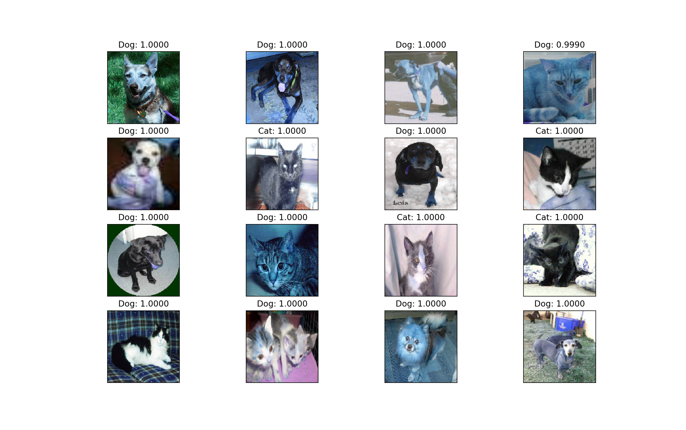

# ConvolutionalNeuralNetwork
A CNN implementation using TFLearn to differentiate cats and dogs for the Kaggle "Dogs vs. Cats Redux: Kernels Edition" challenge.

The model has validation accuracy of 0.8720

